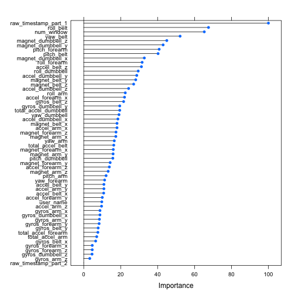

Practical Machine Learning Course Project
========================================================
Aleksey Movchanyuk  
21 September 201


## Abstract
We use the random forest method to estimate features for the Human Activity Recognition data set from Groupware. We that this method produces relevant results.


## Data
The data is taken from the [Human Activity Recognition](http://groupware.les.inf.puc-rio.br/har) programme at [Groupware](http://groupware.les.inf.puc-rio.br/).

We start the data loading procedure by specifying the data sources and destinations.


```
## Loading required package: lattice
## Loading required package: ggplot2
## randomForest 4.6-10
## Type rfNews() to see new features/changes/bug fixes.
```


```r
## Read row data
trainingFile <- 'pml-training.csv'
testingFile     <- 'pml-testing.csv'

training <- read.csv(trainingFile, na.strings = c("", "NA", "#DIV/0!") )
testing <- read.csv(testingFile, na.strings = c("", "NA", "#DIV/0!") )

## Remove 1,5,6 columns 
training       <- training[,-c(1,5,6)]
testing        <- testing[,-c(1,5,6)]


## Define cross validation
## splitting the training data into a test set and a training set
library(caret)

trainingIndex  <- createDataPartition(training$classe, p=.60, list=FALSE)
training.train <- training[ trainingIndex,]
training.test  <- training[-trainingIndex,]
```

Remove entire NAs columns and removes any variables with missing NAs.

```r
## Remove entire NAs columns
rm.na.cols     <- function(x) { x[ , colSums( is.na(x) ) < nrow(x) ] }

training.train <- rm.na.cols(training.train)
training.test  <- rm.na.cols(training.test)


## Removes any variables with missing NAs
complete       <- function(x) {x[,sapply(x, function(y) !any(is.na(y)))] }

training.train <- complete(training.train)
training.test  <- complete(training.test)
```


## Method
We use the **Random Forests** method [@breiman2001random], which applies **bagging** to **tree learners**. 


```r
library(randomForest)
random.forest <- train(training.train[,-57],
                       training.train$classe,
                       tuneGrid=data.frame(mtry=3),
                       trControl=trainControl(method="none")
                       )
```


## Results
Some statistics on the results


```r
summary(random.forest)
```

```
##                 Length Class      Mode     
## call                4  -none-     call     
## type                1  -none-     character
## predicted       11776  factor     numeric  
## err.rate         3000  -none-     numeric  
## confusion          30  -none-     numeric  
## votes           58880  matrix     numeric  
## oob.times       11776  -none-     numeric  
## classes             5  -none-     character
## importance         56  -none-     numeric  
## importanceSD        0  -none-     NULL     
## localImportance     0  -none-     NULL     
## proximity           0  -none-     NULL     
## ntree               1  -none-     numeric  
## mtry                1  -none-     numeric  
## forest             14  -none-     list     
## y               11776  factor     numeric  
## test                0  -none-     NULL     
## inbag               0  -none-     NULL     
## xNames             56  -none-     character
## problemType         1  -none-     character
## tuneValue           1  data.frame list     
## obsLevels           5  -none-     character
```


We now compare the results from the predition with the actual data.


```r
confusionMatrix(predict(random.forest,
                        newdata=training.test[,-57]),
                training.test$classe
                )
```

```
## Confusion Matrix and Statistics
## 
##           Reference
## Prediction    A    B    C    D    E
##          A 2232    0    0    0    0
##          B    0 1518   11    0    0
##          C    0    0 1357    8    0
##          D    0    0    0 1278    0
##          E    0    0    0    0 1442
## 
## Overall Statistics
##                                         
##                Accuracy : 0.998         
##                  95% CI : (0.996, 0.999)
##     No Information Rate : 0.284         
##     P-Value [Acc > NIR] : <2e-16        
##                                         
##                   Kappa : 0.997         
##  Mcnemar's Test P-Value : NA            
## 
## Statistics by Class:
## 
##                      Class: A Class: B Class: C Class: D Class: E
## Sensitivity             1.000    1.000    0.992    0.994    1.000
## Specificity             1.000    0.998    0.999    1.000    1.000
## Pos Pred Value          1.000    0.993    0.994    1.000    1.000
## Neg Pred Value          1.000    1.000    0.998    0.999    1.000
## Prevalence              0.284    0.193    0.174    0.164    0.184
## Detection Rate          0.284    0.193    0.173    0.163    0.184
## Detection Prevalence    0.284    0.195    0.174    0.163    0.184
## Balanced Accuracy       1.000    0.999    0.995    0.997    1.000
```


```r
plot( varImp(random.forest) )
```

 

## References
